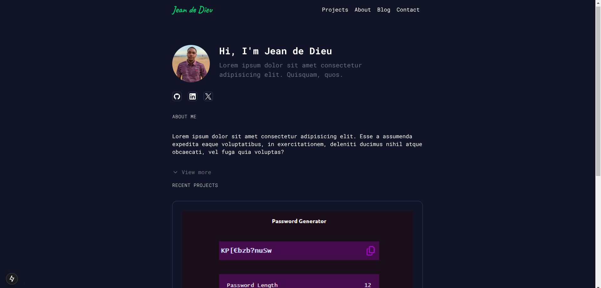

# Portfolio

This is my portfolio website.



## Features

- Responsive design
- Dark mode
- Project section
- Contact section
- About section
- Blog section
- Last played song (Spotify API) (coming soon..)

## Requirements

- Node.js
- npm

## Technologies

- Next.js
- Tailwind CSS
- TypeScript
- Shadcn UI

## Getting Started

```bash
git clone https://github.com/johnOfGod33/Portfolio.git
npm install
npm run dev
```
